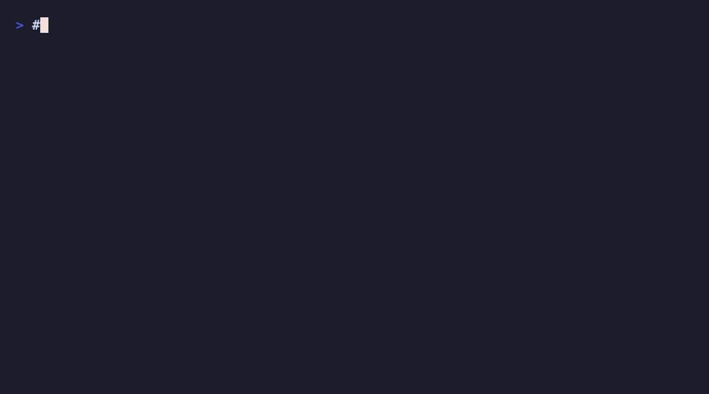

# c64

Command your C64 Ultimate from the terminal.

[](https://www.npmjs.com/package/@jeffsand/c64)
[](https://github.com/jeffsand/c64/actions/workflows/ci.yml)
[](https://opensource.org/licenses/MIT)



## Features

- **Mount and play** -- D64, CRT, PRG files from local disk, URLs, or ZIP archives
- **Full auto-play** -- one command does mount, reset, LOAD, and RUN
- **Remote keyboard** -- type on the C64 from your terminal via PETSCII injection
- **File browser** -- list and upload files to the device storage
- **Live monitoring** -- watch drive status changes in real time
- **Network discovery** -- scan your LAN to find C64 Ultimate devices
- **Data disks** -- create, manage, and inspect blank D64 save disks
- **Agent-ready** -- JSON output on every command for scripting and AI agents
- **Shell completions** -- tab completion for bash, zsh, and fish

## Requirements

- Node.js 20 or later
- A [C64 Ultimate](https://ultimate64.com/) device on your local network
  (Ultimate 64, Ultimate 64 Elite, Ultimate-II+, or Ultimate-II+L)

## Install

```bash
npm install -g @jeffsand/c64
```

## Quick Start

```bash
# Find your device on the network
c64 discover --save

# Check device status
c64 info

# Play a game (uploads from your Mac, mounts, resets, types LOAD + RUN)
c64 play game.d64

# Mount a disk image
c64 mount game.d64

# Run a cartridge
c64 run game.crt

# Type on the C64 keyboard
c64 type 'POKE 53280,0'
```

## Commands

| Command | Description |
|---------|-------------|
| `c64 info` | Device info and status (includes drives) |
| `c64 drives` | Drive status (what is mounted) |
| `c64 mount <file>` | Mount a disk image (D64, CRT, ZIP, URL) |
| `c64 eject` | Eject a drive |
| `c64 run <file>` | Auto-detect file type and run |
| `c64 play <file>` | Full play sequence: mount, reset, LOAD, RUN |
| `c64 reset` | Reset the C64 |
| `c64 reboot` | Reboot the Ultimate hardware |
| `c64 type <text>` | Type on the C64 keyboard |
| `c64 ls [path]` | List files on device storage |
| `c64 upload <file>` | Upload a file to the device |
| `c64 discover` | Scan network for C64 Ultimate devices |
| `c64 watch` | Watch drive status for changes |
| `c64 disk list` | List data disks |
| `c64 disk create` | Create a blank data disk |
| `c64 disk dir <id>` | Show D64 directory listing |
| `c64 config show` | Show current configuration |
| `c64 config set` | Set a configuration value |
| `c64 config init` | Interactive first-time setup |
| `c64 completions <shell>` | Generate shell completions |

Run `c64 --help` for the full reference, or `c64 <command> --help` for details on any command.

## Smart Input Handling

The `mount`, `run`, and `play` commands accept any of these as input:

```bash
# Local files -- uploaded to the device automatically
c64 play game.d64
c64 run cartridge.crt

# ZIP archives -- extracts the D64/CRT/PRG inside
c64 play game.zip

# URLs -- downloads first, then plays
c64 play https://example.com/game.d64

# Device paths -- mounts directly (no upload needed)
c64 mount /USB0/games/Paradroid/Disk1.d64

# Directories -- finds the first playable file
c64 play ./game-folder/
```

## Watch Mode

Monitor drive activity in real time:

```bash
$ c64 watch
Watching C64 Ultimate at 192.168.1.42 (Ctrl+C to stop)

21:30:01  Drive A: 1541 -- game.d64
21:30:01  Drive B: 1541 -- (empty)
21:30:05  Drive A: 1541 -- other.d64    [changed]
```

Polls every 2 seconds. Only prints when something changes.

## Configuration

Set your device IP once and forget about it:

```bash
# Auto-discover and save
c64 discover --save

# Or set manually
c64 config set device.host 192.168.1.42

# View config
c64 config show
```

Config file location: `~/.config/c64/config.json`

### Configuration precedence

1. `--host` flag (highest priority)
2. `C64_HOST` environment variable
3. Config file (`device.host`)
4. Default: none (will prompt you to configure)

### Environment variables

| Variable | Description |
|----------|-------------|
| `C64_HOST` | Device IP address |
| `C64_TIMEOUT` | Connection timeout in seconds |
| `NO_COLOR` | Disable colored output |

## Shell Completions

Generate and install tab completions for your shell:

```bash
# Bash
c64 completions bash >> ~/.bashrc

# Zsh
mkdir -p ~/.zfunc
c64 completions zsh > ~/.zfunc/_c64
# Add to .zshrc (before compinit): fpath=(~/.zfunc $fpath)

# Fish
c64 completions fish > ~/.config/fish/completions/c64.fish
```

## For Scripting and Agents

Every command that outputs data supports `--json` for structured output:

```bash
# Get firmware version
c64 info --json | jq .firmwareVersion

# Check what is mounted
c64 drives --json | jq '.[0].imageFile'

# List files as JSON array
c64 ls --json /USB0/games/ | jq '.[]'

# Quiet mode for scripts (suppress informational messages)
c64 mount game.d64 --quiet
```

### Exit codes

| Code | Meaning |
|------|---------|
| 0 | Success |
| 1 | General error |
| 2 | Usage error (bad arguments) |
| 3 | Device error (unreachable, file not found) |
| 4 | Network error |

## How It Works

The CLI communicates with the C64 Ultimate using three protocols:

- **REST API (port 80)** -- device info, drive management, running files
- **TCP binary protocol (port 64)** -- keyboard injection and machine reset
- **FTP (port 21)** -- file uploads and directory listing

All communication happens over your local network. No internet connection required. No cloud services. Just you and your C64.

## Data Disks

Create blank D64 images for use as save disks on the C64:

```bash
# Create a new blank disk
c64 disk create --name "SAVE-01"

# List your data disks
c64 disk list

# Inspect the directory
c64 disk dir 1
0 "SAVE-01         " 01 2A
664 BLOCKS FREE.
```

Data disks are stored locally at `~/.config/c64/disks/`.

## Contributing

See [CONTRIBUTING.md](CONTRIBUTING.md) for setup instructions and guidelines.

## Disclaimer

This project is not affiliated with, endorsed by, or associated with Gideon's Logic Architectures or any successor to Commodore. "Commodore 64" and "C64" are trademarks of their respective owners. "Ultimate" is a product of Gideon's Logic Architectures.

## License

MIT
